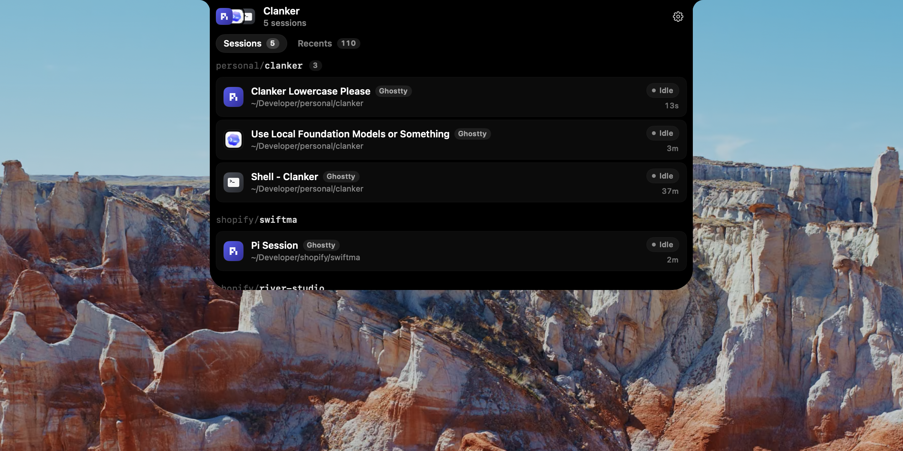

<p align="center">
  
</p>

<h1 align="center">Clanker</h1>

<p align="center">
  A dynamic-notch app for macOS that surfaces your coding-agent sessions and recent projects right in the notch.
</p>

<p align="center">
  
  
  
</p>

---

<p align="center">
  
</p>

## What it does

Clanker lives in your MacBook's notch. Hover to expand — see every running agent session and recently visited project at a glance, then click to jump straight to it.

- **Sessions** — tracks Codex, Claude, Pi, and bare terminal sessions automatically
- **Recents** — surfaces your most recently visited git repos from your project roots
- **Focus** — click any session to raise the exact terminal window

## Install

### Download

Download the latest release from the [Releases](https://github.com/jaytel0/clanker/releases) page and move `Clanker.app` to your `/Applications` folder.

Clanker checks GitHub Releases in the background every few hours. When a newer release is available, it shows a small Update pill in the notch menu and can download, replace, and relaunch `Clanker.app` for you.

> **First launch:** macOS may ask you to grant Accessibility access so Clanker can raise terminal windows. This is a one-time prompt.

### Build from source

Requires Xcode 16+ / Swift 6.

```bash
git clone https://github.com/jaytel0/clanker.git
cd clanker
bash script/build_and_run.sh install
```

## Usage

- **Hover** the notch to expand the panel
- **Click** any session row to bring that terminal window to the front
- **⚙** (gear icon, top-right of header) → Choose Sources to change project folders, or Quit
- **Settings** (⌘,) → Recents tab to manage project roots and the `cd` hook
- **Settings** (⌘,) → Updates tab to check GitHub Releases manually or change update notifications

## Requirements

- macOS 14 Sonoma or later

## License

MIT
